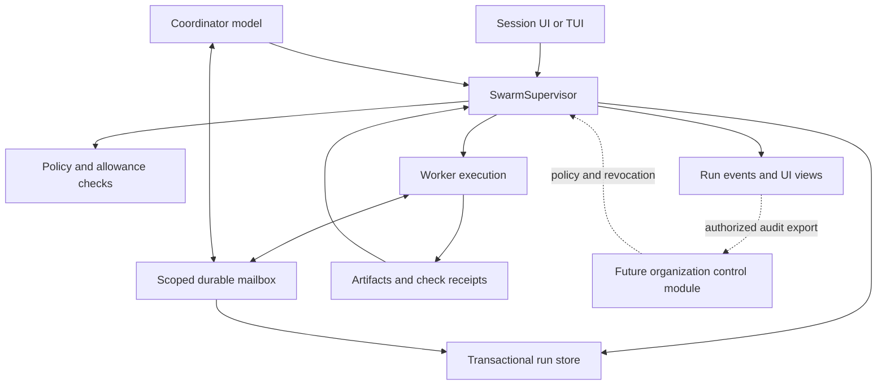

# Swarming: product and implementation plan

**Status:** approved implementation direction; local readers, writers, Team controls,
managed execution and cross-session collaboration have source/browser evidence.
The current Windows candidate passed its scripted reference scenarios. Live-model
and deployment-specific qualification remain.
No qualified release yet. See [delivery/evidence](swarming-progress.md) and
[implementation contracts](swarming-contracts.md) for current status.

**Date:** September 26, 2026.

**Source inspection:** client checkout at `454adc4`; no runtime tests or paid
model evaluations were run for this proposal.

**Confirmed direction:** local swarming first, enterprise controls designed in
from the start; collaboration inside one session first, between sessions later.

**Roadmap:** added to the [Lumi feature roadmap](../ROADMAP.md#planned-feature-swarming-2026-09-26).
The user subsequently authorized autonomous implementation through all P0–P7
milestones. The [delivery/evidence ledger](swarming-progress.md) records current
source and qualification status. Detailed design choices in
this document remain proposals unless resolved in the implementation contracts;
roadmap inclusion is not validation or release qualification.

This plan does not resume the paused [AI Employee initiative](ai-employees-handoff.md),
its experiments, learning, grants, or heartbeat. Swarming is a provider-adaptive
execution feature. An ordinary swarm worker is not a persistent AI Employee.
Any later connection must be an explicit, separately qualified integration.

## 1. Recommended product pattern

Build a **supervised team attached to a session**. The user states an outcome;
the coordinator divides it into useful work; the supervisor enforces ownership,
permissions, lifecycle, and evidence; workers exchange scoped messages and
return artifacts. The user gets one accountable conversation and an inspectable
team, with live intervention controls.

Separate the supervisor's two functions:

- **Runtime authority:** deterministic code admits work, owns durable state,
  enforces policy and allowances, handles cancellation, and accepts evidence.
- **Coordinator reasoning:** the selected model proposes plans, interprets
  findings, requests assignments, resolves conflicts, and explains decisions.

The coordinator cannot grant itself more authority. A message from a worker
cannot change policy, create another worker, approve its own result, or spend
outside the run's allowance. The runtime remains responsive when a model stalls.

Use a hierarchy for decisions and scoped peer messaging for collaboration.
Workers can ask each other questions directly through the mailbox; ownership,
plan revisions, integration, and completion remain supervisor decisions. Do not
force every factual exchange through an additional coordinator model call.

| Pattern | Benefit | Tradeoff | Decision |
| --- | --- | --- | --- |
| Independent parallel tool calls | Low overhead for simple inspection | No persistent collaboration or assignment ownership | Keep for ordinary work |
| Supervised workers with scoped messaging | Clear accountability with useful collaboration | Requires durable orchestration and explicit contracts | Adopt |
| Unrestricted peer mesh | Flexible discovery | Harder authority, conflict, spend, and termination control | Exclude initially |
| Organization-wide model supervisor | One apparent place to coordinate | Excessive access and a reasoning bottleneck | Use deterministic organization policy and per-session supervisors |

Swarming is suitable when independent investigation, implementation, and review
can advance the objective. A small edit or a tightly coupled change should stay
with one agent. The coordinator must be allowed to conclude that parallel work
would add overhead and proceed within the user's selected configuration.
Anthropic's research-system account supports scoped delegation and describes
coordination overhead; its research results do not establish a coding speedup
for Lumi. Our workload choice is a design inference to validate locally.
[Source](https://www.anthropic.com/engineering/multi-agent-research-system).

## 2. Scope and defaults

The first useful release supports:

- One project and one active swarm run in the active session; multiple historical
  runs remain inspectable. Preserve the app's current single foreground workspace.
- One coordinator using the session's explicitly selected model.
- Two worker slots by visible default, configurable up to four for the first
  supported envelope. Coordinator requests count separately in total concurrency.
- Native engine workers first, with explore, implement, and verify assignments.
  Workers are created for ready work and can finish when their assignment ends.
- Local durable messaging, a dependency graph, isolated writers, evidence-bound
  review, budget controls, and restart recovery with explicit user continuation.
- A complete session control surface and local run report.

Concurrency is a disclosed operational setting, not an invisible quality limit.
Do not introduce hidden token, context, output, or dollar caps into ordinary chat.
Users can set limits for swarm runs; managed organizations can require them.
The app displays the effective settings and why a requested change is blocked.

Defer cross-session work, remote hosts, nested worker teams, persistent employee
learning, automatic model selection outside configured choices, autonomous
deployment, and scheduled unattended execution. A new session does not activate
swarming merely because another session used it.

## 3. Existing foundation and required changes

Source references below are inspection evidence, not new test results.

| Current source | What can be reused | What swarming must add or change |
| --- | --- | --- |
| [`AgentRegistry`](../lumi/engine/agent_runtime.py) | Worker records, transcripts, steering, controls, restart assignments | Explicit session/run ownership, attempt identity, transactional transitions, durable message receipts |
| [`Session._execute_task` and `_execute_task_batch`](../lumi/engine/session.py) | Child execution, event forwarding, context and handoff construction | Asynchronous assignment admission; coordinator must not wait for an entire batch before receiving useful results |
| [`engine/director.py`](../lumi/engine/director.py) | Dependency graph, scheduler, attempt history, decision structure | Extract suitable rules; strengthen evidence and authority; avoid two competing graph owners |
| [`gui/app.py::_wire_session`](../lumi/gui/app.py) | Shared runtime wiring | It explicitly retires Director Mode and clears legacy settings. Add a separate versioned swarm configuration path; never silently reactivate old flags |
| [`WorktreeManager`](../lumi/engine/worktrees.py) | Worktree creation, retained branches, clean-checkout integration | Fail closed on isolation failure; staged combined verification; durable integration ownership across processes |
| [`artifacts.py`](../lumi/engine/artifacts.py), [`context_broker.py`](../lumi/engine/context_broker.py) | Typed artifacts and provenance-aware context | Run-scoped access, immutable result manifests, message artifact references, delivery records |
| [`FlightRecorder`](../lumi/engine/flight_recorder.py) | Run manifests, event records, OTLP-style export | Complete causal IDs, policy decisions, message delivery, retained uncertainty; enterprise audit export is additional work |
| [`gui/runtime.py`](../lumi/gui/runtime.py) | `BackendSpec`, credential resolution, session construction | Worker construction with isolated mutable backend state and explicit model identity |
| [`gui/ws_commands.py`](../lumi/gui/ws_commands.py), [`gui/chat_loop.py`](../lumi/gui/chat_loop.py) | Command dispatch and active-run lifecycle | Typed swarm commands, captured ownership, replay cursors, UI-independent controls |
| [`engine/jobs.py`](../lumi/engine/jobs.py) | Owned job handles, status, cancellation, shutdown | Attach jobs to swarm/attempt identity and report confirmed termination |

Five source details prevent treating swarming as a UI-only change:

1. The GUI clears legacy Director configuration. Existing engine types do not
   mean a working desktop Director product is available.
2. `_execute_task` can fall back to a shared workspace when worktree creation
   fails. A swarm writer must remain blocked instead.
3. Child sessions are constructed with `auto_approve=True`. Swarms need explicit
   grants and policy checks at execution, including a central approval inbox.
4. `DirectorRun.acceptance_gate` includes text matching of acceptance-check names
   against handoffs. Swarm acceptance must use typed, attributable check receipts.
5. Existing records use JSON/JSONL and in-process locks/threads. They do not by
   themselves provide transactional messaging, process isolation, or distributed
   leadership. Interrupted workers must be reconciled rather than called resumed.

Reuse useful behavior and existing tests, then migrate deliberately. Preserve
ordinary `task`/`task_batch` behavior unless a separately reviewed change is
needed. The [Director guide](director-mode.md) is background for extraction,
not an instruction to undo its retirement.

## 4. User experience

### Starting and using a swarm

1. The user enables **Swarm** in an existing session or chooses a saved swarm
   preset. Existing project selection and empty-draft behavior still apply.
2. Setup shows coordinator/worker models, worker slots, allowed actions, optional
   spend/time/request limits, and the source of any organization restriction.
   Workers inherit the selected model unless the user explicitly configures others.
3. The coordinator proposes a short work plan: work items, dependencies, likely
   overlap, expected evidence, and whether swarming is useful. The user can edit
   it. A preset may authorize automatic start within its scope; do not require a
   second permission prompt for work already authorized.
4. The supervisor admits ready assignments. The conversation shows meaningful
   decisions and results; detailed tool traffic and agent messages have inspectors.
5. Workers raise questions and blockers through one inbox. Related requests are
   grouped; the coordinator resolves factual questions when evidence permits.
6. The user can steer the objective, pause an assignment, cancel a worker, reduce
   concurrency, or stop the entire swarm. All controls show their actual status.
7. Completion presents the combined result, verification evidence, total known
   usage, unresolved uncertainty, and the retained branch/diff or artifact.

### Proposed session panel

| Surface | Information and controls |
| --- | --- |
| Summary strip | Objective, phase, accepted/remaining work, active workers, known/reserved/unknown cost, elapsed time, policy profile |
| Work board | Ready, running, waiting, review, accepted, blocked; dependency view is optional |
| Worker inspector | Assignment, model/provider, scope, current action, last progress, messages, handoff, checks, workspace |
| Decisions inbox | Questions, approvals, scope conflicts, uncertain side effects; show the evidence and consequence of each choice |
| Messages | Participants, work item, kind, delivery state, replies, artifact links; filter by worker or blocker |
| Changes and evidence | Combined diff, exact revision, named checks, failures, review findings, integration status |
| Run history | Plan revisions, attempts, policy version, interventions, restart history, export |

Use an expandable panel within the existing session interface and a compact
summary in the conversation. Keep projects/sessions in the existing sidebar.
Do not turn every worker into a top-level session or force a new dashboard for
ordinary use. Provide keyboard actions and a list alternative to graph views;
preserve focus, manual scroll position, drafts, and compact layouts.

Worker count and token count are diagnostic information, not a progress score.
Show accepted work and open requirements. If replanning changes the denominator,
explain it rather than showing a misleading completion percentage.

### Control meanings

| Control | Contract |
| --- | --- |
| Steer | Record a new instruction revision and deliver at the next safe model/tool boundary; runtime decisions use the latest applicable revision |
| Pause worker | Stop admitting its next actions; show `pausing` while its current action is still active |
| Pause swarm | Freeze dispatch and new effects; reach a checkpoint or stop owned execution according to the visible pause policy |
| Stop swarm | Immediately revoke new action admission, request cancellation, stop owned jobs/process trees, and preserve partial results |
| Resume | Continue a live paused run only after checking grants, reservations, and current state |
| Recover | After process loss, reconcile effects and create new attempts explicitly; do not silently replay uncertain work |

Pause is not rollback. Stop is not rollback. A remote or unresponsive process
must remain visibly `stop unconfirmed` until termination is observed or its
execution authority expires. After acknowledgement of a pause/stop command, the
admission gate must reject new actions; already admitted effects need their own
recorded outcome.

## 5. Architecture and module responsibilities



Keep the initial implementation a modular Python application. Messaging is a
first-class module with durable semantics, but does not require a separately
installed server. Extract remote deployment only when a second host is needed.

| Module | Small public interface | Complexity owned inside |
| --- | --- | --- |
| `SwarmSupervisor` | `handle(command, principal)`, `snapshot(run_id)`, `events(run_id, after)` | Run state, graph ownership, admission, replanning, acceptance, stopping and recovery |
| `SwarmMailbox` | `send(message, principal)`, `receive(cursor, principal)`, `ack(receipt, principal)` | Scope checks, persistence, delivery, expiry, deduplication, backpressure, read receipts |
| `SwarmPolicy` | `evaluate(action, context)`, `reserve(request)`, `settle(receipt)` | Effective grants, policy versions, approvals, atomic allowance reservations, revocation |
| Worker execution module | `start(assignment)`, `control(attempt, command)`, `inspect(attempt)` | Native worker processes, captured context, process ownership, tool gates, backend lifecycle |
| Result integration module | `prepare(result_set)`, `verify(candidate)`, `apply(candidate, expected_base)` | Immutable manifests, integration workspace, conflicts, check evidence and user-checkout protection |

These are responsibility seams, not a requirement to create five deployed
services or a generic framework. The local and eventual hosted adapters must
honor the same observable contracts. Add internal seams only where behavior
actually varies, such as provider construction, the clock, or process execution.

`SwarmSupervisor` owns run/work-item/attempt orchestration state. Existing
`AgentRegistry` remains the transcript/live-control registry and references the
swarm IDs; its display status is a projection for swarm-owned records. Do not
maintain two independently mutable task graphs. Legacy sessions retain their
existing persistence until a separate migration is justified.

### Local storage and execution topology

- Put `swarm/state.sqlite` under the existing project runtime directory,
  alongside existing artifacts, traces, workers, and checkpoints. Never inside
  the source repository or a network-shared SQLite file.
- Keep current state, commands, events, messages, receipts, approvals, leases,
  and reservations in one database so related updates can commit atomically.
- Use short transactions, foreign keys, unique idempotency constraints, busy
  handling, schema versions, and tested backup/recovery. Use durable commit
  settings for acknowledgement-bearing operations.
- Write immutable artifact content first, verify its digest, then commit its
  reference. Clean up unreferenced content only through a retention procedure.
- A local supervisor event loop owns orchestration. Workers execute outside the
  UI event loop; use managed subprocesses for the supported writer release so
  their process trees can be controlled independently.
- One active supervisor lease per run, with a monotonically increasing epoch.
  Every action, delivery, result, and settlement carries its attempt and epoch.
  Reject stale authority after recovery. Lease expiry alone is insufficient to
  terminate a process; reconcile it before admitting a replacement writer.

SQLite WAL is a reasonable local option: it permits concurrent readers and a
writer but still has one writer at a time and requires same-host access. Keep
that constraint explicit and verify the bundled SQLite version before choosing
WAL settings. This is a proposed implementation choice, not an existing store.
[Source](https://www.sqlite.org/wal.html).

## 6. Identity, data, and state contracts

Use the [glossary](../CONTEXT.md) consistently. Every authorization decision
resolves identities from trusted execution context, never from model-supplied
`tenant_id`, `owner_id`, or role text.

| Record | Essential fields |
| --- | --- |
| Swarm | ID, project/session IDs, owner principal, configuration version, optional organization scope |
| Run | ID, swarm ID, objective/revision, instruction revision, phase, policy version, epoch, timestamps |
| Work item | ID, run ID, objective, dependencies, role, read/write scope, required capabilities, acceptance-criterion IDs, revision |
| Attempt | ID, work-item/revision, worker/agent ID, backend/model, input artifact hashes, base revision, grant, lease, status |
| Message | ID, sender/recipient scope, run/work-item/attempt, kind, causal IDs, sequence, expiry, payload/artifact references |
| Action receipt | Originating model-request ID, tool-call ID, arguments digest, principal, grant/policy, attempt/epoch, admitted/started/finished state |
| Check receipt | Criterion ID, attempt, exact candidate revision, command/check identity, trusted executor, exit status, output artifact, timestamps |
| Decision | Actor, reason, previous/new revision, referenced evidence, policy result, time |
| Reservation | Scope, purpose, provider request identity, reserved amount, settled amount, accounting state |
| Approval | Specific action/arguments digest, resource and revision, requester/approver, expiry, uses, policy version |

Use opaque stable project IDs for remote synchronization; local paths and their
hashes are not global identities. Include schema/protocol versions from the
first local release. A personal scope is explicit, not a privileged null tenant.

Proposed run states: `draft -> ready -> running -> reviewing -> completed`.
Additional states include `waiting_for_user`, `pausing`, `paused`, `stopping`,
`cancelled`, `failed`, and `recovery_required`. Waiting and review may return to
running through a recorded decision. Recovery creates a new execution epoch.

Work items move through `pending -> ready -> leased -> running -> submitted ->
accepted`, with `blocked`, `cancelled`, and `failed` branches. A rejected submission
creates a new attempt; it never edits the previous attempt's result.
Integration status is separate: `not_applicable`, `pending`, `verified_candidate`,
`applied`, or `conflict`. A run cannot be completed while required integration,
verification, process cleanup, or approval remains outstanding.

Use optimistic revision checks for commands from multiple UI viewers. Reject
dependency cycles, duplicate active ownership, and edits to running assignment
contracts. Plan changes produce revisions; changed requirements invalidate
affected acceptance evidence without erasing it. Waiting items release scarce
model slots. Circular question dependencies trigger replanning or escalation.

## 7. Messaging design and agent tools

### Communication model

Provide direct mailboxes and narrowly scoped work-item channels. Default messages
are addressed; broadcast requires a permitted channel. The supervisor can inspect
run-scoped communication, but the coordinator receives relevant summaries and
events rather than every worker transcript.

Keep three distinct categories:

- **Commands:** authorized requests to change state, such as dispatch, pause,
  approve, or cancel. Only the supervisor applies them.
- **Events:** runtime observations such as a request starting, a check finishing,
  a message being delivered, or a lease expiring.
- **Agent messages:** attributed findings, questions, replies, blockers, proposed
  changes, and result references. These are untrusted task data, not authority.

Useful message kinds are `finding`, `question`, `answer`, `blocker`,
`change_proposal`, and `handoff_reference`. Runtime status events have a separate
source type. Agents cannot impersonate a human, policy decision, or check runner.

### Initial tool surface

| Tool | Who receives it | Contract |
| --- | --- | --- |
| `swarm_status` | Coordinator and workers | Returns authorized graph/participants, assignment, constraints, and relevant state |
| `swarm_send` | Coordinator and workers | Sends a typed message to an allowed participant/channel; returns a durable receipt |
| `swarm_receive` | Coordinator and workers | Reads pending messages with a cursor; optional bounded wait releases the model slot |
| `swarm_submit` | Assigned worker | Submits an immutable handoff with artifact/check references; cannot accept the result |
| `swarm_plan` | Coordinator | Proposes a versioned acyclic graph or revision |
| `swarm_assign` | Coordinator | Requests dispatch of ready work; returns attempt IDs promptly |
| `swarm_decide` | Coordinator | Requests accept/revise/block/integrate/complete; runtime validates authority and evidence |

The native tool adapter acknowledges context delivery automatically after
durably recording which messages entered the worker's model input. Models should
not need a housekeeping tool to manage acknowledgements. A transport acknowledgement
means persisted delivery, not that a model understood or completed the request.
An answer or handoff has its own explicit message/result.

If tool usability tests reveal overlap, simplify this surface before adding
general-purpose tools. Keep `artifact_read` for full evidence instead of copying
large outputs into mailboxes. Do not expose worker spawning to child sessions.

### Delivery and safety semantics

1. Persist the message and recipient deliveries before returning `accepted`.
   A UI socket notification is only a wakeup; lost notifications are recoverable.
2. Guarantee at-least-once delivery, not exactly-once external effects. Use a
   message ID, sender idempotency key, recipient receipt, and unique constraints.
3. Distinguish accepted, delivered-to-runtime, included-in-context, answered,
   expired, rejected, and undeliverable. Each receiver has its own cursor.
4. Order messages by durable per-run/per-recipient sequence and retain causal
   links. Do not infer causality from wall-clock timestamps or claim global order.
5. Deliver into active model context at safe boundaries. Do not rewrite an
   in-flight request. If no worker is active, retain delivery and notify the
   supervisor; sending a message alone does not authorize fresh model spending.
6. Delivery receipts bind an attempt, input revision, and model request. If a
   request fails before durable input assignment, redeliver. If request execution
   is uncertain, retain that uncertainty and reconcile before retrying effects.
7. Recheck scope at send, receive, and artifact fetch. Exclude closed epochs and
   revoked recipients. Grant revocation blocks future access but cannot retract
   information already delivered to a model or process.
8. Bound payload size, outstanding requests, reply depth, wakeups, and per-sender
   traffic. Initial tunables: 8 KiB inline bodies, 100 pending deliveries per
   worker, and a visible warning before refusing more traffic. Store larger
   content as authorized artifacts. Tune from fixtures; these are proposed values.
9. Reserve control-path capacity so status chatter cannot delay stop/revocation.
   Coalesce redundant progress notifications; never silently drop action receipts,
   approvals, errors, or accounting uncertainty. Quarantine malformed traffic.
10. Detect repeated request/reply loops and lack of artifact progress. Escalate
    with evidence; a transport heartbeat is not a model call or useful progress.

### Local versus hosted transport

Start with database-backed local mailboxes plus in-process wakeups. For multiple
hosts, use a hosted transactional store, authenticated worker connections, and
a transactional outbox. PostgreSQL is the proposed hosted record store; validate
it in the hosted design spike rather than building the remote adapter now.

Use database delivery/outbox workers initially. Add a broker if measured fanout,
latency, or independently deployed consumers justify it. NATS JetStream is a
candidate for durable delivery with acknowledgements and redelivery, not a
replacement for policy checks, the run database, or effect reconciliation.
Its acknowledgement contract explicitly permits redelivery, so consumers still
need idempotency. [Source](https://docs.nats.io/learn/jetstream/delivery-and-acknowledgment).

Avoid committing to Kafka, Redis, NATS, and a workflow platform simultaneously.
A broker can deliver a request twice; only the runtime and executor can decide
whether its effect already happened. Store updates and outgoing notifications
in one transaction, then publish notifications from the outbox. Consumers commit
their receipt/state before acknowledging the transport.

## 8. Worker execution, context, and verified integration

### Assignment admission

For each ready work item, the supervisor checks dependencies, capability support,
scope conflicts, worker capacity, effective policy, model selection, and allowance.
It atomically creates the attempt and reserves capacity before starting work.
Only the assigned worker may submit for that attempt.

Each assignment includes the objective, acceptance criteria, relevant project
instructions, scoped context, base revision, permitted tools/resources, input
artifact references, allowance, and explicit return contract. Preserve full
source evidence in retrievable artifacts; use summaries for navigation.

While workers own changes, the coordinator uses planning, inspection, messaging,
and decision tools. It must not bypass integration by editing their files or
running a merge through a general shell. It can request an implementation
assignment for work it would otherwise perform itself. Read-only worker profiles
must exclude unrestricted shell execution; the existing explore prompt alone
does not establish read-only enforcement.

Do not share mutable conversation/backend state between workers merely because
they use the same model. Construct workers through the existing runtime wiring,
with separate request and conversation identities. For SONN, preserve the user's
saved session identity and explicitly distinguish generated worker assignments,
messages, summaries, and real tool observations. Agent messages and supervision
must not become human learning input or blanket route-training credit.

Native request attribution must exist before executing a tool:

```text
human instruction revision
  -> swarm run / work item / attempt
  -> model request / response
  -> tool call / permission decision
  -> observed result / artifact
  -> check receipt / acceptance decision
```

Do not claim that this proposed chain closes the paused AI Employee attribution
work. That integration retains its own requirements and qualification gates.

### Files, shared resources, and process isolation

- Writer attempts get separate worktrees from pinned input revisions. If Git or
  isolation is unavailable, block writer swarming; offer read-only swarming or a
  user-selected serial workflow. Do not silently use the shared checkout.
- At start, show the actual input base. Uncommitted user changes are not silently
  omitted from a task that depends on them. Offer an explicit checkpoint/snapshot
  path or wait for an appropriate baseline, preserving the user's index/files.
- Read workers use pinned snapshots when consistent input matters. A live shared
  read view must be identified as such and cannot substantiate revision-specific
  verification without a matching snapshot.
- File scopes prevent unauthorized edits, but different files can still conflict
  semantically. Record ownership of shared contracts, schemas, dependencies,
  generated outputs, and build configuration; serialize or coordinate those changes.
- Worktrees do not isolate ports, databases, browser sessions, editor projects,
  caches, or credentials. Assign fixture resources explicitly. Browser/desktop
  and creative-editor mutation require exclusive resource leases and remain out
  of the initial worker tool set until tested.
- A worktree and Python path checks are not an operating-system sandbox. Tool
  allowlists must be enforced at dispatch, including shell/check execution;
  prompts and labels such as "read only" are insufficient.
- Use managed worker processes with scrubbed environments and captured ownership.
  Arbitrary project scripts can execute code under the user's account. Strong
  containment for enterprise work requires tested OS/container/VM restrictions,
  restricted credentials, and controlled network egress. Do not advertise that
  guarantee for the initial personal desktop mode.
- Preserve `job_start`/`job_status`/`job_cancel`, the existing 20-minute managed-job
  limit, and client-exit cleanup. A larger swarm duration does not silently extend
  individual job limits or authorize detached processes.

### Completion and integration

1. The worker submits a manifest containing result artifacts, changed files,
   base/result hashes, actual check receipts, blockers, and its recommendation.
2. The supervisor verifies authorship, current attempt/epoch, allowed write scope,
   input freshness, and required evidence. A model's `passed: true` is a claim.
3. A verify assignment or trusted check runner validates the exact candidate.
   An independent review uses a separate context and no authorship authority;
   a second model opinion alone is not independent execution evidence.
4. Combine accepted writer outputs in a separate integration worktree and run
   checks on the combined candidate. Individually passing branches may fail together.
5. Expose the candidate for review. Apply to the user's checkout only under the
   selected integration policy, while it is clean and still at the expected base.
   A dirty checkout or changed base defers application and retains the candidate.
6. Record the applied revision and any necessary post-application checks. If a
   check fails, retain failure evidence and propose repair; do not reset user work.

The integration lock must be per canonical repository and effective across
processes, with revision rechecks immediately before application. Do not rely
only on the current class-level `RLock`. Integration changes need their own
checkpoints and idempotency records; an unknown merge outcome requires inspection.

Reusing `WorktreeManager` does not mean inheriting its current merge-first path.
The new candidate-verification path should avoid modifying the user's checkout
just to discover that the combined changes do not pass.

## 9. Governing permissions, approvals, and budgets

### Policy and authority

Evaluate policy before context disclosure, model invocation, tool execution,
message delivery, artifact access, integration, and external publication. Effective
authority is the intersection of organization, project, session, assignment, and
tool/resource grants. A lower scope may narrow authority; it cannot override a deny.

Record a policy decision ID, version, reason, and relevant action digest.
Re-evaluate revocation at each effect boundary, even if a plan was admitted earlier.
Tightening policy affects new admissions immediately; expanded access requires a
new explicit grant. Approvals bind action arguments, resource/revision, expiry,
and permitted use count. Changed arguments or inputs invalidate an old approval.

For solo users, provide understandable presets such as **Inspect**, **Implement
and review**, and **Custom**. Show the effective permissions before execution.
Preauthorized actions proceed without repeated questions. Exceptional requests
enter the central inbox with concrete evidence and a reason approval is needed.

Credentials remain in the trusted backend/tool execution module. Workers receive
references or narrowly scoped execution grants, not organization owner tokens.
Never serialize credentials in `BackendSpec`, prompts, message bodies, artifacts,
or diagnostics. Remote authentication must bind actor, host, tenant, audience,
assignment, and expiry; do not trust client-supplied ownership fields.

If the mailbox is later exposed through MCP, keep MCP as a tool adapter over
the same runtime. It is not a queue or scheduler. Remote authorization must use
the protocol's audience/resource validation and must not pass unrelated tokens
through the server. [Source](https://modelcontextprotocol.io/specification/2026-07-28/basic/authorization).

### Usage and allowance accounting

Track coordinator, worker, review, repair, and auxiliary model calls separately,
while charging all applicable work against the shared run and parent scopes.
Track main-request allowances, tool calls, tokens, wall time, and dollars as
different quantities. Provider/CLI costs may be unavailable; unavailable is not zero.

Before a paid request, atomically reserve an allowance against every applicable
budget scope. Concurrent workers cannot each spend the same remaining balance.
Settle from provider evidence where available; retain uncertain reservations
after timeout/interruption until reconciled. Retries have explicit identities,
and retrying does not erase the original possible charge.

Late results from stopped or superseded attempts remain historical observations;
they cannot reopen assignments or authorize integration. Trusted reconciliation
may still settle the original request's actual charge exactly once. Rejecting a
stale worker's authority must not hide genuine spend or release an uncertain hold.

Distinguish **reported**, **estimated**, **reserved**, and **unknown** amounts in
the UI. A hard monetary guarantee is available only when the execution path can
bound or enforce the provider charge, including output/reasoning behavior and
retries. Otherwise label it a soft spending target, expose the uncertainty, and
offer enforceable request/concurrency/time limits. Managed policy may deny an
unmetered execution path; do not silently downgrade a hard requirement.

For later multi-host execution, centrally reserve bounded sub-allowances for
hosts before they work. Local reservations consume that allocation. Reconcile
expired/uncertain allocations before reuse; a network partition must not create
duplicate purchasing authority. Fair scheduling prevents one run from consuming
all organization or provider capacity.

User-visible alerts should lead to a useful choice: reduce concurrency, narrow
scope, pause, authorize an increase, or continue with an explicitly permitted
uncertainty. Do not silently downgrade models or truncate evidence to meet a cap.

## 10. Monitoring and enterprise governance

### Three monitoring levels

| Audience | Default view | Authorized actions |
| --- | --- | --- |
| Run owner | Current objective, worker activity, blockers, messages, evidence, cost and changes | Steer, pause/stop, review, approve within policy, recover |
| Team/project operator | Active runs by project and owner, stale hosts, queue age, exceptions, capacity, cost allocation | Triage and pause/stop permitted runs, route approvals, adjust project limits |
| Organization administrator/auditor | Policy versions, enrolled hosts, providers, aggregate usage, access and action history | Manage policy/access; inspect/export evidence only under explicit content permission |

Separate permissions for viewing operational metadata, viewing content, reading
source artifacts, controlling a run, approving actions, administering policy,
and exporting audit data. Administrator status must not automatically imply
access to every private conversation. A manager can see a blocked run without
receiving its source code or full transcript.

For human employee monitoring, make the managed-workspace indicator and data
collection policy visible to the employee. Limit reporting to managed work:
no keystroke logging, covert screen capture, or unrelated personal sessions.
Prefer verified outcomes, interventions, failures, resource use, and unresolved
work over employee rankings based on token or message volume. Retention and
content-access rules need organization-specific review before deployment; this
plan makes no jurisdictional compliance claim.

### Runtime health and useful alerts

Emit structured events for dispatch, model/tool lifecycle, message delivery,
context inclusion, scope decisions, check results, integration, budget changes,
lease status, and controls. Include run/attempt/request/action correlation IDs.
Reuse the flight recorder and extend trace export; keep audit records distinct
from sampled performance telemetry. Never record hidden model reasoning as a
monitoring requirement.

Measure:

- Time to first useful result and to verified completion.
- Acceptance rate, integration conflicts, revisions, and reopened failures.
- Queue time, message age, delivery latency, coordinator wait, and worker utilization.
- Last execution heartbeat separately from last useful artifact or state change.
- Approval wait, permission denials, repeated-action loops, and intervention count.
- Known/reserved/unknown cost, provider rate limits, and local compute capacity.
- Stop acknowledgement and confirmed process termination latency.

Alert on actionable conditions: stalled dependency chain, missing executor,
repeated failing attempts, unresolved side effect, exhausted allowance, overdue
approval, stale policy lease, failed verification, and unconfirmed stop. Group
related alerts, suppress repeats while unchanged, and attach the evidence and
next available action. Idle waiting on a human is different from a dead worker.

### Hosted organization control module, later

Add a central organization module for identity/group synchronization, policy
distribution, host enrollment, quota allocation, fleet status, approvals, and
audit ingestion. Keep one accountable supervisor per run; central governance
does not require a model reading every employee's conversation.

Enterprise milestones need tenant-scoped authorization on every query, message,
artifact, export, and administrative command; isolated storage access; encrypted
transport and storage; retention/deletion workflows; administrative access logs;
and tested revocation. Integrate SSO and group provisioning when this phase starts.
Version policy and runner/tool protocols; drain or retain compatible runners for
active runs during upgrades rather than changing their semantics mid-attempt.

Default hosted synchronization should send operational metadata and authorized
evidence references. Raw prompts, source files, and transcripts require a defined
content policy. Redact secrets before persistence/export, log content access,
and apply retention across local copies, hosted stores, indexes, and backups.
Preserve minimum audit tombstones without retaining deleted sensitive payloads.
Any retention hold must have a recorded authority and scope.

Local append-only JSON is useful diagnostics, not proof against modification by
the local machine owner. Managed audit requires authenticated ingestion and
protected remote retention. Hashes establish content identity; they alone do not
establish trusted execution or tamper resistance.

### Offline behavior and enforcement levels

| Mode | Honest guarantee | On lost central connectivity |
| --- | --- | --- |
| Personal local | Local controls under the user's machine/account | Continues under local policy; no cloud dependency |
| Managed local with reporting | Enrolled client's reported behavior and leased authority for controlled resources | Continue only within a valid offline policy/allowance lease; otherwise pause new effects |
| Managed execution | Controls enforced by organization-owned execution and credential infrastructure | Follow policy: finish only already admitted bounded work or stop; no new unrestricted effects |

A central stop cannot instantly stop an offline unmanaged machine. Show last
contact, stop-request acknowledgement, authority expiry, and confirmed execution
state separately. Lease expiry limits access to controlled resources; it does
not magically stop arbitrary local CPU work. Enterprise enforcement must state
which credentials, network paths, and execution environments it actually controls.

## 11. Collaboration between swarms, later

Introduce a **collaboration grant** between specific runs, mediated by their
supervisors. A grant states purpose, participants, permitted message kinds,
artifact/data classes, disclosure rules, request/spend limits, expiry, and who
can revoke it. Both sending and receiving scopes must allow the exchange.

Start with the same project and owner, then explicitly authorized same-tenant
projects/users. Cross-tenant federation is a separate product/security decision.
Do not make every session in a workspace globally discoverable.

Swarm A sends an artifact offer, question, or proposed work request to Swarm B.
B's supervisor decides whether it may disclose context and accept work, records
which owner/budget pays, and creates its own assignment. A cannot direct B's
workers or inherit B's credentials. Neither side receives the other's entire
conversation by default.

Maintain origin IDs and causal links across the grant, limit hops/fanout, dedupe
requests, and detect cycles in cross-run dependencies. Revocation cancels future
deliveries and new work admission; reconcile already accepted work under an
explicit cancellation contract. A stopped initiating swarm does not silently
kill unrelated work in the receiving swarm.

Only start this phase after runtime ownership is no longer tied to mutable
`state.session`/`state.project` selection. Each command, socket subscription,
process, and persistence write must resolve its captured run ownership. The
initial release retains one foreground run; multi-session execution is a
separate capability with its own lifecycle and resource scheduling tests.

## 12. Example end-to-end scenario

Objective: add a CSV export to a project with backend and frontend changes.

1. The coordinator proposes a contract investigation, backend change, frontend
   change, and integrated verification. It records the agreed response schema
   as an artifact before dependent implementation starts.
2. Two writers receive separate worktrees and explicit scopes. The frontend
   worker asks the backend worker about error behavior through `swarm_send`.
3. The backend worker answers with a reference to the schema artifact. A proposed
   contract change goes to the coordinator; the supervisor versions affected
   assignments instead of letting workers silently disagree.
4. One worker needs access to a denied external test endpoint. Its request enters
   the owner's inbox; other independent work continues. Denial produces a visible
   blocker or a permitted local fixture, not hidden credential reuse.
5. Both workers submit results. Checks are attached to each exact result revision.
   The integration module combines them and runs the acceptance checks again.
6. A combined test fails. The run remains in review, creates a scoped repair
   attempt, and retains both failed and passing evidence.
7. The final candidate passes. If the user's checkout became dirty, the result
   is available as a verified candidate with application pending. The UI does
   not report a completed integrated change until the requested application occurs.

An organization operator can see owner, project, state, policy, expense, and the
blocker without reading the CSV contents or the private conversation. Content
access requires a separate entitlement and leaves an audit record.

## 13. Implementation sequence and exit gates

Treat this as a dependency-ordered backlog. Sizes are relative scope, not calendar
promises. Assign engineering owners and estimates after the first architecture
spike. No phase is accepted solely because its classes or unit tests exist.

| Phase / tickets | Deliverable | Dependencies | Exit gate |
| --- | --- | --- | --- |
| P0: SW-001..003, medium | Confirm command/state schemas, trace existing ownership, design simulator and fixture scenarios | This plan | Reviewable contracts, approved release envelope, and baseline single-agent evaluation design |
| P1: SW-004..008, large | Transactional store, supervisor state machine, attempts/epochs, policy admission, reservations | P0 | Concurrent admission, crash/recovery, stale authority, and uncertainty fixtures pass without model calls |
| P2: SW-009..012, large | Durable mailbox, tools, context-delivery receipts, async native worker execution | P1 | Two read workers exchange a scoped finding; coordinator proceeds before the whole batch ends; denied cross-run reads remain denied |
| P3: SW-013..017, large | Writer isolation, narrow grants, process/job ownership, check receipts, integration candidates | P2 | End-to-end writer fixture with overlap, failure, repair, combined verification, dirty checkout, and confirmed stop |
| P4: SW-018..021, large | Setup, session panel, decision inbox, event replay, compact/keyboard UI, recovery controls | P2; writers need P3 | Actual browser controls and native packaged candidate complete the reference scenario |
| P5: SW-022..024, medium | Provider qualification, controlled user pilot, comparative outcome report, local release docs | P3 + P4 | Local release gates below pass; limitations and supported providers are published |
| P6: SW-025..029, very large | Hosted tenant policy, identity, host enrollment, quota allocations, metadata monitoring, protected audit | Stable local release | Two-member/two-host tenant isolation, revocation, offline lease, and audit/access tests pass |
| P7: SW-030..032, large | Collaboration grants and explicit inter-session requests | P6 and independent run ownership | Multi-session cancellation, billing, disclosure, and cyclic dependency cases pass |

P4 can develop against simulated supervisor events while runtime work proceeds.
P6 can be designed early, but hosted deployment must not block proving local value.
User-visible intermediate pilots are read-only first, then controlled writers,
then a supported local release. Do not market an unfinished writer preview as
enterprise-managed execution.

### First implementation slices

- **SW-001: ownership map and command contract.** Trace UI -> captured session ->
  worker -> tool -> artifact -> check -> final state. Specify invariants and
  identify where existing handlers read mutable GUI selection.
- **SW-002: benchmark fixtures.** Select independent investigation, two-writer
  integration, tightly coupled serial work, and interrupted execution fixtures.
  Define exact acceptance checks and baseline configuration before comparing.
- **SW-003: storage/protocol spike.** Prove one atomic assignment/reservation/event
  transaction, one durable message receipt, schema upgrade/backup, and restart
  reconciliation. Decide the minimal durable supervisor loop.
- **SW-009: vertical read-only slice, after P1.** Start a run from a fixture command, dispatch
  two native workers, exchange one artifact reference, submit handoffs, stop/recover,
  and inspect persisted evidence. No production account or paid calls required.

The subsequent tickets expand this slice; they should not build disconnected
dashboards, a general broker deployment, and a second planner first.

### Proposed code placement

```text
lumi/engine/swarming/
  models.py          # Versioned commands, identities, states, messages, receipts
  supervisor.py      # Orchestration and command authority
  store.py           # Atomic local persistence and migrations
  mailbox.py         # Scoped delivery and receipt handling
  policy.py          # Grants, approvals, admission and allowance accounting
  execution.py       # Native worker execution and lifecycle adapter
  integration.py     # Candidate construction and evidence-bound application
  tools.py           # Model-facing schemas and tool handlers
lumi/gui/static/swarm_view.js
```

These are proposed files. Extract established graph/scheduler behavior from
`engine/director.py` into shared engine rules when useful; leave legacy loading
disabled. Avoid copying the whole implementation or wrapping it with competing
state. Wire through `gui/runtime.py`, `gui/app.py`, `gui/ws_commands.py`, session
metadata, and `gui/chat_loop.py`, keeping behavior in the engine. Preserve classic
script/mixin loading and register assets in packaging/bundle policy.

For new swarm records, commit state before dispatch; store dispatch intent in
the same transaction. On a crash between commit and process launch, reconcile
the intent before retrying. Mirror status into `AgentRegistry` through idempotent
events keyed by attempt, so a failed projection never creates a second worker.
Back up before schema changes, preserve historical transcripts, and provide a
read-only recovery path for records a downgraded client cannot understand.

Feature rollout uses a separate `swarming` configuration/version and defaults
off. Disabling it prevents new runs, preserves history and controls for existing
runs, and either lets them drain or stops them explicitly. It must never strand
workers or reactivate legacy Director records. No release version changes are
part of this planning task.

## 14. Verification, benchmarks, and release criteria

### Required behavioral tests

| Scenario | Required observation |
| --- | --- |
| Concurrent budget and work claims | One active attempt and no duplicate allocation of remaining allowance |
| Duplicate/out-of-order delivery | Stable receipt, correct cursor/reply causality, no repeated external effect |
| Crash before/after commit, publish, model request, effect, acknowledgement | Preserved state and uncertainty; no unsafe blind replay |
| Disk full, corrupt store, or unavailable audit storage | No false durable acknowledgement or new unrecorded effect; visible recovery path |
| Old supervisor or worker returns | Stale epoch cannot act, submit accepted work, or double-settle a request |
| Prompt injection in message/artifact | Cannot change actor, policy, grants, target tenant, or approval state |
| Foreign session/tenant/artifact identifier | Denied at query, send, receive, artifact fetch, replay, and export |
| Run floods messages | Backpressure works; stop and revocation remain responsive |
| Slow model, blocked tool, orphan job, application exit | Owned execution is inspected/stopped; UI does not report idle while work continues |
| Restart and explicit recovery | Completed work remains; uncertain effects are inspected; new attempts are distinguishable |
| Isolation fails or checkout is dirty | No shared writer fallback and no user changes/index overwritten |
| Base changes or combined verification fails | Earlier checks cannot accept the new candidate; retained evidence supports repair |
| Tool name/source/revision is fabricated | Text claims cannot satisfy a required check receipt |
| Multiple viewers, navigation, reconnect | Commands target captured run; snapshots plus cursor replay show no missing/duplicate decisions |
| Model/credential configuration changes | Existing ownership preserved; no silent provider switch or secret disclosure |
| CLI worker lacks enforcement/attribution | It is unavailable for profiles requiring those guarantees, with a clear reason |
| Remote partition/revocation/policy upgrade | Limited leased authority, accurate stale-state display, reconciled outstanding allocations |

Test through public module interfaces with controlled providers, clocks, process
fixtures, and temporary projects/state. Add fault injection around transactional
and effect boundaries. Assertions should verify behavior, not mirror private
implementation or CSS structure. Check Windows process ownership and filesystem
behavior on Windows; generic mocks do not prove them.

Exercise real browser events for enable/setup, keyboard focus, worker inspection,
messages, grouped approvals, pause/stop, reduced concurrency, dirty-checkout
integration, reconnect, restart recovery, session switching, and compact widths.
Test text-only providers receiving screenshot artifacts on the next model request;
an artifact reference must not imply visual interpretation.

Run the repository's prescribed Ruff, Pytest, JavaScript syntax, UI recovery,
and diff checks for implementation changes. For release, use a separate source
copy with `scripts/build_clean.ps1`, then verify the executable, HTTP UI,
WebSocket, logs, and packaged assets. Do not rebuild over a running bundle.

### Provider qualification

Publish an execution capability matrix: native delegation, messaging, scope
enforcement, cancellation, request accounting, check provenance, and modality
delivery. Qualify a local native adapter and a hosted native adapter before
expanding the supported matrix; choose exact user-configured models explicitly.

Codex/Claude CLI adapters retain their own tool loops. Add them only through a
separately qualified adapter with honest restrictions. A CLI process can emit
useful lifecycle events without providing the native tool admission guarantees.
Never imply equivalent enforcement or transfer of native provider conversations.

### Outcome evaluation

Compare ordinary single-agent execution, current batch delegation where supported,
and swarming on the same fixture objectives and input revisions. Include useful
parallel work and a serial-heavy control. Keep model/tool access comparable and
record concurrency, actual cost, provider failures, and all operator interventions.
Use multiple runs and predeclared criteria; one successful demo proves little.

Primary outcomes are accepted-result correctness, failure/rework, evidence quality,
and time to a trustworthy result. Secondary measures are cost, message volume,
duplicated investigation, worker idle time, and approval load. Use both operational
comparisons and equal-resource controls so extra spending is not confused with
better coordination. Judge final artifacts against checks rather than expecting
identical intermediate steps.

### Proposed release gates, not measured results

- Zero unauthorized admissions, cross-scope disclosure, lost acknowledged commands,
  silent shared writers, or unsupported completion claims in the fault/security suite.
- All required reference scenarios complete with attributable verification and
  accurate partial/failure states; ordinary chat retains its existing regression gates.
- Proposed local responsiveness targets: control acknowledgement p95 below 500 ms,
  UI event visibility p95 below one second, and owned interruptible processes
  confirmed stopped within five seconds. Exceptions must remain explicitly visible.
  Establish baseline loads and platform conditions before enforcing these targets.
- Demonstrated benefit on a predeclared parallelizable task set without a material
  correctness regression; report serial-task overhead and cost honestly. Define the
  numerical benefit threshold after the baseline, before comparative pilot runs.
- Real browser and packaged Windows evidence, separate from mocked providers and
  live-model outcomes. Live paid qualification requires its own authorized scope.
- Operator controls, backup/recovery, retention, support diagnostics, and rollback
  are documented before local release. P6 additionally requires hosted operational
  readiness and genuine enforcement evidence for managed claims.

## 15. Decisions and remaining product choices

Confirmed by the user: local first; enterprise-aware contracts from inception;
within-session collaboration first; cross-session collaboration later.

Recommended design decisions in this proposal: one runtime supervisor per run;
coordinator reasoning separate from authority; scoped peer messaging; local
transactional store; native-first workers; isolated candidate integration;
metadata-first organization monitoring; explicit collaboration grants.

Resolve the following before the corresponding phase, without blocking this plan:

| Choice | Working recommendation | Needed by |
| --- | --- | --- |
| Name and interaction | Swarm mode inside the existing session, with expandable team panel | P0/P4 |
| Default team size | Two worker slots; visible first-release maximum of four | P0 |
| Integration autonomy | User reviews candidate by default; saved policy can authorize verified application | P3 |
| Initial provider matrix | Native local plus native hosted; exact models selected explicitly | P2/P5 |
| Public limits and benchmark threshold | Choose from measured baseline and pilot data; disclose all limits | P5 |
| Enterprise deployment | Start with managed execution/reporting distinction; choose hosted or self-hosted with initial customers | P6 |
| Enterprise content retention | Metadata by default; project-scoped content access and explicit retention rules | P6 |

The first engineering milestone should be the durable, read-only vertical slice
with controllable workers and recoverable messaging. That proves the new
coordination contract before writer integration or organization-wide rollout.
